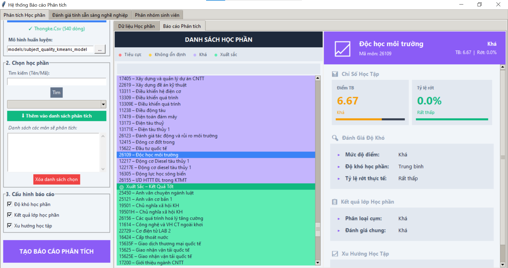
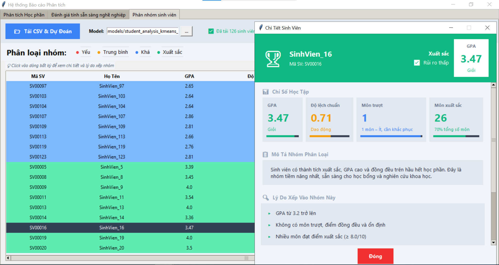
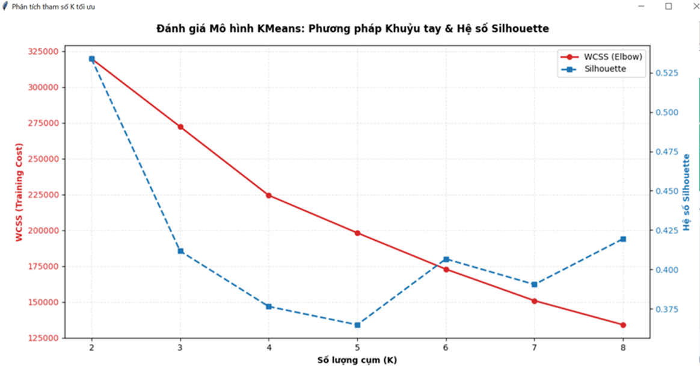
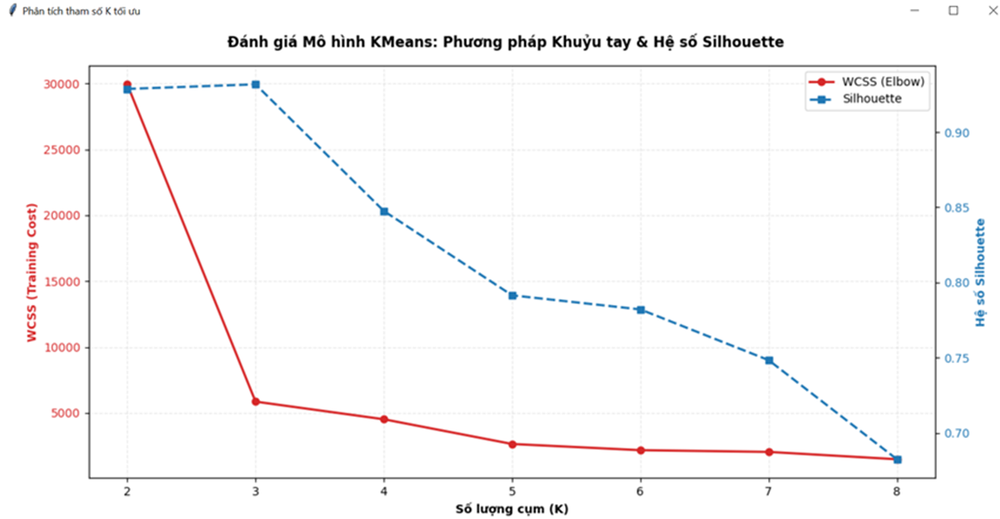

# Hệ thống Phân tích và Đánh giá Dữ liệu Học tập Sinh viên

Dự án này là một ứng dụng Desktop được xây dựng bằng **Python (Tkinter)** và **Apache Spark (PySpark)**, nhằm mục đích phân tích dữ liệu học tập của sinh viên. Hệ thống kết hợp các kỹ thuật Học máy không giám sát (KMeans Clustering) và Logic Rule-based để đưa ra các đánh giá đa chiều về học phần và sinh viên.

## 🌟 Các tính năng chính

Hệ thống bao gồm 3 chức năng phân tích cốt lõi:

### 1. Phân tích Học phần (Subject Analysis)
Đánh giá chất lượng giảng dạy và độ khó của từng học phần dựa trên phổ điểm.
- **Phân cụm chất lượng**: Sử dụng KMeans để phân loại môn học thành 4 nhóm: `Tiêu cực`, `Trung bình`, `Khá`, `Xuất sắc`.
- **Trích xuất đặc trưng**: Sử dụng 10 chỉ số như Điểm TB, Độ lệch chuẩn, Tỉ lệ A-F, Tỉ lệ mất tư cách (MTC%), Trung vị (TV).
- **Rule-based**: Kết hợp quy tắc để đánh giá Độ khó (Khó, Trung bình, Dễ) và Xu hướng học tập (Tích cực, Bình thường, Tiêu cực).

### 2. Phân nhóm Sinh viên (Student Risk Prediction)
Dự đoán mức độ rủi ro học vụ của sinh viên để có biện pháp hỗ trợ kịp thời.
- **Tiền xử lý & Tổng hợp**: Tính toán GPA (hệ 4), độ lệch chuẩn điểm số, đếm số môn rớt và số môn xuất sắc từ bảng điểm chi tiết.
- **Phân loại**: Chia sinh viên thành 4 nhóm: `Yếu` (Nguy cơ cao), `Trung bình`, `Khá`, `Xuất sắc`.
- **Giao diện trực quan**: Cung cấp danh sách sinh viên với cảnh báo màu sắc và Popup chi tiết giải thích lý do xếp nhóm kèm theo gợi ý cải thiện.

### 3. Đánh giá tính Sẵn sàng Nghề nghiệp (Career Readiness)
Đánh giá mức độ sẵn sàng tham gia thị trường lao động của sinh viên dựa trên năng lực chuyên môn (GPA tổng) và ngoại ngữ (TOEIC).

## 📸 Hình ảnh Demo & Đánh giá Mô hình

### Giao diện Hệ thống

*Giao diện phân tích và hiển thị kết quả.*


*Chi tiết phân loại nhóm.*

### Đánh giá Mô hình (Silhouette & WCSS)

*Biểu đồ đánh giá số lượng cụm tối ưu (K).*


*Kết quả đánh giá chất lượng phân cụm.*

## 📂 Cấu trúc thư mục

```text
📦 NCKH
 ┣ 📂 data/               # Thư mục chứa dữ liệu CSV (dữ liệu thô)
 ┣ 📂 models/             # Chứa các mô hình KMeans đã được huấn luyện (.load)
 ┣ 📂 src/                # Mã nguồn chính của ứng dụng
 ┃ ┣ 📂 gui/              # Giao diện người dùng (Tkinter tabs, popups)
 ┃ ┣ 📂 ml/               # Logic Machine Learning (Huấn luyện & Dự đoán bằng PySpark)
 ┃ ┣ 📂 services/         # Lớp dịch vụ kết nối giữa GUI và ML Models
 ┃ ┗ 📂 utils/            # Các hàm tiện ích (Load CSV, chuyển đổi điểm...)
 ┣ 📜 main.py             # File khởi chạy ứng dụng chính (Giao diện người dùng)
 ┣ 📜 training_ui.py      # Giao diện hỗ trợ huấn luyện lại các mô hình ML
 ┗ 📜 README.md           # Tài liệu dự án
```

## 🛠️ Công nghệ sử dụng

- **Ngôn ngữ**: Python 3.10+
- **Giao diện**: Tkinter, ttk
- **Xử lý dữ liệu & Machine Learning**: Apache Spark (PySpark MLlib, Spark SQL)
- **Công cụ khác**: Pandas (để hiển thị dữ liệu nhỏ gọn trên UI)

## 🚀 Hướng dẫn cài đặt và sử dụng

### Yêu cầu hệ thống
- Java 8 hoặc 11 (yêu cầu bắt buộc để chạy Apache Spark).
- Python 3.10 trở lên.
- Biến môi trường `JAVA_HOME` và `SPARK_HOME` đã được cấu hình đúng.

### Cài đặt thư viện
Cài đặt các thư viện Python cần thiết:
```bash
pip install pyspark pandas
```

### Chạy ứng dụng
Khởi chạy giao diện chính của ứng dụng phân tích:
```bash
python main.py
```

Khởi chạy giao diện huấn luyện mô hình (nếu bạn muốn train lại các model KMeans với dữ liệu mới):
```bash
python training_ui.py
```

## 💡 Lưu ý về Data Pipeline
Hệ thống sử dụng `VectorAssembler` để gom các đặc trưng và `StandardScaler` (đối với dữ liệu học phần có thang đo lệch nhau) trước khi đưa vào mô hình KMeans. Các mô hình ML được tải động từ thư mục `models/` tại thời điểm chạy.